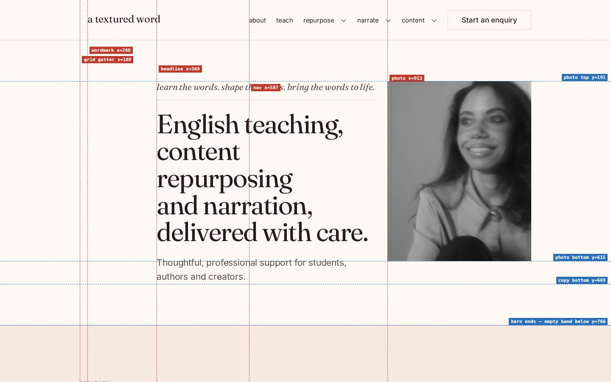
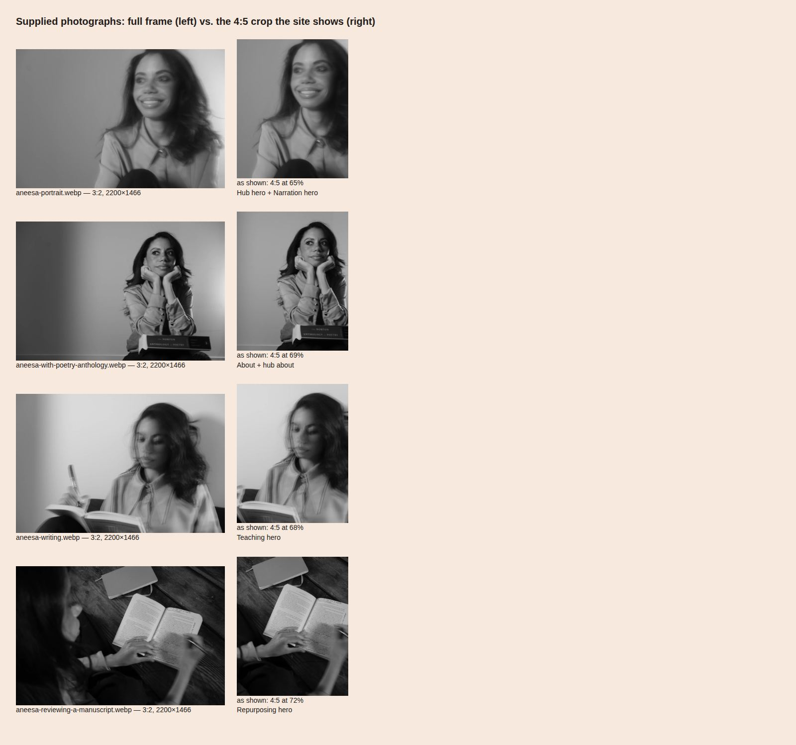
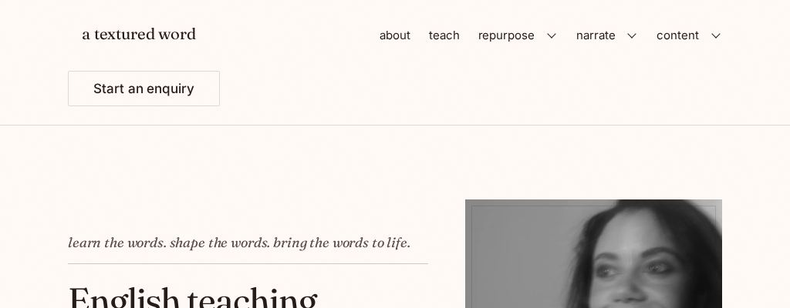
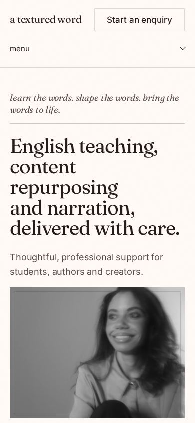
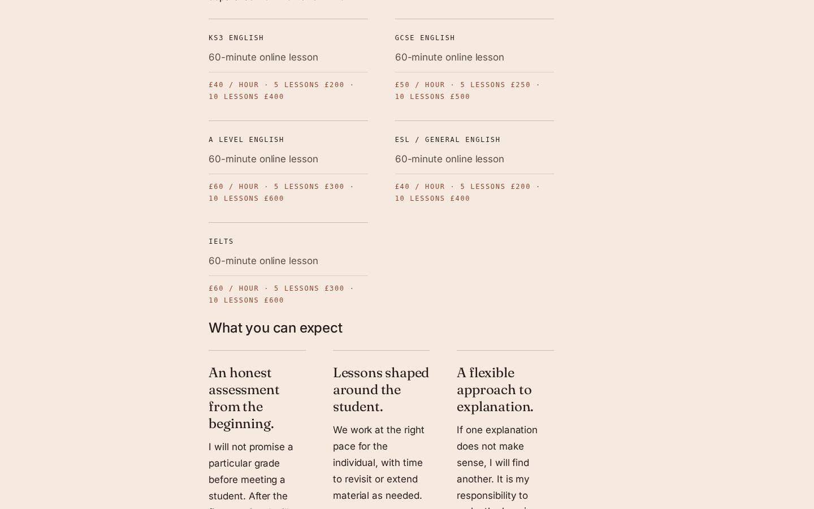
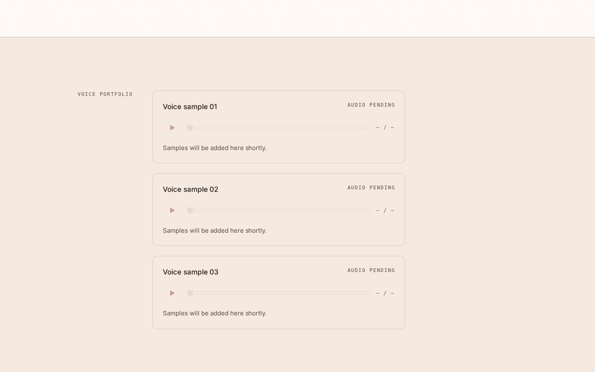
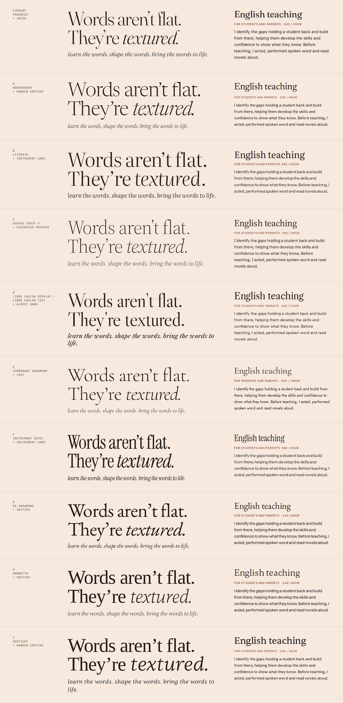

# a textured word — brand and visual audit

Companion to `AUDIT.md`, which covers code, accessibility and performance. This document looks at the site the way a design director would, and ends with the design principles and the list of improvements that Phases 3–5 will carry out.

**Method**
- Rendered 9 pages at 390, 768, 1024 and 1440px.
- Measured every text node, hairline, left edge and image in the DOM, and the colour make-up of each first screen (by pixel).
- Looked at the four supplied photographs at full resolution.
- Downloaded ten candidate type pairings and set the brand's own lines in each (§5).

Evidence images are in `audit/`. The measurement scripts ran from a scratch directory and are not part of the site.

**Content guarantee.** Nothing proposed here changes a word of copy, a URL or a slug. Where a proposal changes *where* approved copy appears or *how prominently*, it's marked **(placement)**.

---

## 0. Verdict

The site is **well-mannered, but it has no concept.** It is calm and literate, but nothing about it could only belong to *a textured word*. Swap the wordmark and it could belong to any considered consultant.

The frustrating part is that the concept is already in the material:
- **The photographs are the brand.** All four were shot with deliberate motion blur, double exposure and grain, which is texture made visible. All four are landscape, with the subject on the right and open space on the left, as if composed for type to sit beside them. The site crops them to small portrait thumbnails, puts a hairline frame inside each, and throws both qualities away (§3.4).
- **The brand line is the headline.** *Words aren't flat. They're textured.* is approved copy, and it sits in section four.
- **The brief already designed a signature:** the pencil-in wordmark taken from a hand-lettered sign. It was never built.

So the job isn't inventing a brand. It's **turning up the volume on what's already there** and removing what's diluting it.

### Scorecard

1 = absent, 5 = fully expressed.

| Brief attribute | Score | Evidence |
|---|---|---|
| *Textured* (the idea) | **1** | The grain is imperceptible, the surfaces are flat, the photos' texture is cropped out, and there's no signature device. |
| Calm, unhurried | 3 | Generous space, but uniform. 11 identical section shells read as monotony, not calm. |
| Assured | 2 | Headlines are medium-sized, there is no dominant element per screen, and nothing on the page makes a confident statement. |
| Graceful | 3 | Fraunces at display size is graceful. The small type (12px tracked mono ×40–52 per page) is not. |
| Well read / literary | 3 | Serif and italics help. But the page reads as a web template (cards, chips, bordered boxes), not as a book or a journal. |
| Warm, not sterile | **2** | The paper is nearly white (`#FFFAF6`), the photos are cold grey, and the only saturated area is a plum footer that relates to nothing else. |
| Competent, composed | 3 | Tidy details, but 10–13 different left edges per page at desktop. The structure isn't felt. |
| *Not* busy | 2 | 13–17 distinct text styles per page and 58–95 hairlines per page. It's quiet, but it's cluttered. |
| *Not* clinical | **2** | Near-white paper plus grey photos plus hairlines plus mono reads as a spec sheet. |

---

## 1. From brand words to visual attributes

This is the translation every later decision is checked against.

| The brief says | So visually | And never |
|---|---|---|
| **Words have grain** | Material surfaces: paper with visible tooth, photography with its blur and grain kept, type set large enough that you can see the letterforms | Flat fills, glossy gradients, frosted glass |
| **Calm, unhurried** | Few elements per screen, one focal point, space that changes with importance, slow and short motion | Evenly spaced stripes, dense grids of equal boxes |
| **Assured** | One large typographic statement per page, set with total confidence | Five medium-sized things competing |
| **Graceful** | A serif with real display cuts and a true italic; restrained weights | Heavy weights, faux-bold, tracked-out caps everywhere |
| **Well read** | Book and journal conventions: running heads, chapter numbering, italics for emphasis, marginalia, proper figures | Tech-product conventions: chips, pills, cards, badges |
| **Warm luxury waiting room** | Warm paper, warm-graded photos, one deep warm dark surface | Near-white, cool greys, unrelated accent colours |
| **Private practice, not marketplace** | Few calls to action, spoken in sentences | Buttons everywhere, "Explore →" ×5 |

---

## 2. Measured, not guessed

### 2.1 Density per page (desktop 1440 / mobile 390)

| Page | Text styles | Mono labels | Hairlines | Distinct left edges (1440) | Height (screens, 390) | Image share of page (1440) |
|---|---|---|---|---|---|---|
| `/` | 15 | 19 | 58 | **10** | 7.5 | 7.8% |
| `/about` | 14 | 11 | 34 | 7 | 4.7 | 3.2% |
| `/teaching` | 17 | 40 | 68 | 9 | 8.3 | **1.8%** |
| `/repurposing` | 17 | 42 | 68 | **11** | 8.4 | **1.7%** |
| `/narration` | 17 | **52** | **95** | **13** | **9.7** | **1.4%** |
| `/contact` | 9 | 12 | 48 | 2 | 2.6 | 0% |
| `/content` | 15 | 17 | 77 | 4 | 3.6 | 0% |

Reference points for high-end editorial sites:
- **5–7 text styles** (display, heading, lead, body, small, label, and perhaps a quote);
- **2–3 left edges** at desktop;
- imagery taking **15–35%** of a service page.

This site has double the styles, four times the edges, and a tenth of the imagery.

### 2.2 Colour make-up of each first screen, versus the brief's budget

The brief (§2.6) sets a budget of neutrals 85–92%, ink 6–12% and clay 1–3%, with no more than three clay elements per screen.

| First screen (1440) | Neutral | Ink | **Clay** | Photo |
|---|---|---|---|---|
| `/` | 86% | 5% | **0.0%** | 8% |
| `/about` | 86% | 4% | **0.0%** | 9% |
| `/teaching` | 90% | 4% | 0.8% | 5% |
| `/contact` | 98% | 1% | **0.0%** | 0% |
| `/content` | 98% | 1% | 0.2% | 0% |

**The brand colour is below budget on every page, and at zero on the home page.** At 390 the home page is also 0% clay. The terracotta that the brief built the palette around is effectively not part of the visual identity.

### 2.3 Alignment (home, 1440)

Five vertical lines in the first screen:
- grid gutter, x = 188
- wordmark, x = 206
- headline, x = 369
- nav, x = 587
- photo, x = 913

**None of them repeats.** Horizontally, the photo's top lines up with the eyebrow, but its bottom (615) lines up with nothing, and the copy ends at 669. Then the hero stops at 766, and **a blank band fills the bottom of the screen**.

---

## 3. Brand assets

### 3.1 Wordmark

- It's live text in Fraunces 24px, lowercase, with no drawing, no lockup and no mark. It's the same treatment as a nav link, just larger.
- The brief's signature (§1.4) was a **pencil-in**: a hand-lettered sign, drawn once per session as a single-stroke SVG with a graphite texture, settling into type. **Not built.**
- The brand-size review pages (`/review/*`) show the only other treatment tried: *textured* in italic clay. **That's the right instinct.** The italic is the texture.

**Direction:**
- Keep the wordmark typographic, set in the new serif, with *textured* in the italic. The italic word gives the name a built-in rhythm change: *a textured word*.
- Build the pencil-in as the one signature moment. It runs once per session, under reduced motion it shows the finished state, and it stays under 12 KB (per the brief).

### 3.2 Favicon

A generic app-icon: a plum rounded square with a sans "T" and a clay dot.
- It uses none of the brand's type.
- The "T" doesn't correspond to anything, since the brand is lowercase.
- The rounded square is a phone-OS idiom.

**Direction:** a lowercase italic *t* (or *w*) in the new serif, set in ink on paper, with no container.

### 3.3 Colour

| Token | Now | Brief | Verdict |
|---|---|---|---|
| `--paper` | `#FFFAF6` | `#F7E9DE` | **Too white.** It reads as screen-white with a blush, not paper. |
| `--coconut` (band) | `#F6E9DF` | `#D5CBC0` | **Too close to the paper.** A 1.16:1 step makes bands look like a rendering tint, not a change of surface. |
| `--paper-lift` | `#FFFFFF` | `#FCF4EC` | Pure white inputs on warm paper look like form fields from another site. |
| `--ink` | `#241C1A` | same | Good. Keep. |
| `--clay` / `--clay-ink` | `#AF593E` / `#8F4530` | same | Good colours, **almost never shown** (§2.2). |
| `--surface-dark` (plum) | `#5B3B4E` | same | Beautiful, but orphaned. It appears only in the footer, so the page ends in a different key from the one it was written in. |
| `--olive`, `--plum` tokens | unused | — | Remove, or give them a job. |
| `--teal` | scrubber only | same | Correct, and invisible until audio exists. |

**Direction** (values are finalised in Phase 3 `DESIGN.md` with measured contrast):
- Take the paper back toward the brief. It should be a warm uncoated stock, not near-white.
- Deepen the band into a real second surface (about 1.3:1 against the paper).
- **Use clay at display size**: the italic *textured*, one pencil mark per page, and the primary action. That lands inside the brief's 1–3% budget rather than at 0%.
- Connect the dark surface to the page. Either use plum for one mid-page moment as well (a single pull-quote band, which the brief allows), or retune the dark surface toward a deep warm ink-brown so the footer reads as the page's own shadow.

### 3.4 Photography: the biggest untapped asset

**What was supplied:** four black-and-white frames at 2200×1466 (3:2). Three were **shot with intentional motion blur or double exposure** (portrait, writing, manuscript), and one is sharp and poised (the anthology). The subject sits in the **right half of every frame**, with soft, open wall or floor on the left. The manuscript frame is literally a textured word: wood grain, a handwritten margin note, the page of a book.

**What the site does:**
- **Crops all four to 4:5.** The negative space the photographer composed goes, and the writing frame loses the pen and the book. That's the action that makes it "the written word".
- **Shows them at about 11% of the first screen** at desktop (339×423px), inside a hairline frame 8px inside the edge. It's a placeholder idiom that says "image goes here".
- **Leaves them as neutral grey on warm paper,** so they look cold, like photocopies laid on the page. The brief's §2.7 warm grade was never applied.
- **Uses the same portrait for the hub hero and the Narration hero.**
- **Serves them at 2200px to every device**, with no responsive sizes (see `AUDIT.md`).

**Direction:**
- **Use them in their own shape.** Mostly 3:2 and wide, with the subject right and type in the space left, the way they were shot. Portrait crops only where a column demands it, and then a deliberate crop, not 4:5 by default.
- **Give one photograph per page real scale**: at least half the screen at desktop, and edge to edge on mobile.
- **One grade for all photography:** a warm duotone that maps black to `--ink` and white to `--paper`, plus a matched grain, so photos and paper are visibly the same material. This is pure CSS or SVG, costs no bytes and leaves the originals untouched.
- **No inner hairline frames.** The photograph is the object; it doesn't need a mount.
- **One photo per page, no repeats in the first screen:**

| Page | Photo | Why |
|---|---|---|
| Hub | portrait | the warmest, the one looking out at you |
| Teaching | writing | pen and book, the taught word |
| Repurposing | manuscript | annotation, the written word |
| Narration | anthology | poised, the spoken word, and a book in hand |
| About | portrait at a different crop, or the anthology in a different crop | Her portrait page gets the sharpest, most present frame |

### 3.5 Typography (summary; §5 has the full study)

- Fraunces (display) + Inter (text) + an **unloaded** monospace that falls back to whatever the system has.
- **9 visible text styles in the first 1,000px of the home page**, and 13–17 per page.
- Fraunces weights are picked per component (300 in one place, 400 in another), and so are Inter's (400 or 500).
- The most common size on the site is **12px uppercase mono, tracked 0.14em**. It's the hardest text to read, and it's what the site uses for labels, prices, credentials, form labels and exits.

### 3.6 Graphic devices

| Device | Count | Verdict |
|---|---|---|
| 1px hairlines | 34–95 per page | **Overused.** They separate everything from everything, so they stop meaning anything. |
| 12px mono gutter markers ("SERVICES", "ABOUT ANEESA") | every section | Good idea, over-applied. As the *only* section title on spokes they're too weak. |
| Clay 2px "rule mark" on asides | a few per page | A good, ownable detail, but too small to register. |
| Bordered cards | pillars, content routes | Web-template idiom. It reads like a SaaS pricing page. |
| Bordered chips (tags) | voice tags, content tags | Same. Six outlined chips in a row reads as a filter bar. |
| Framed images (inset hairline) | every image | Remove (§3.4). |
| `→` arrows | 10+ per page | Too many. The arrow is Inter's glyph, not drawn. |
| 3% grain overlay | global | Right idea, **invisible** on near-white paper. |

### 3.7 Motion

- Beyond the diagnosis in `AUDIT.md` §5.3 (a stale preview, reduced motion switching everything off, reveals firing at the bottom edge): motion has **no signature**. It's a generic "fade up" on every block.
- The brief's one characterful motion idea, the pencil-in, is missing.
- **Direction:**
  - one pencil-in (wordmark);
  - one "drawn" pencil underline under the italic *textured*;
  - quiet reveals with a light stagger for groups;
  - no whole-page fades;
  - nothing above the fold waits to be readable.

### 3.8 Voice (visual consequences only; no copy changes)

- The copy is warm, first-person, unhurried and British. It's a good voice, set in a register that doesn't match it: uppercase mono labels bark ("EVERY FIELD EXCEPT THE DEADLINE IS REQUIRED. SUBMITTING OPENS…") where the voice murmurs.
- **Direction:** set labels and notes in sentence case, in the text sans at a readable size. Keep uppercase for a few real markers, if any. The case transform is CSS, so the words are untouched.

---

## 4. Page by page

### 4.1 Global header

- **Desktop 1440:** fine, but the wordmark is 18px off the grid (x=206 against a gutter of 188), a lone off-grid line.
- **1024: broken.** The CTA wraps onto a second row under the wordmark, so the header is 162px tall and lopsided. 
- **768 and 390:** two rows. Wordmark plus an outlined button, then a full-width "menu" row with a rule, about 135px (16% of a phone screen) before any content. The outlined header button competes with the wordmark for the top-right.
- **Direction:**
  - one row at every width;
  - wordmark on the grid line;
  - on mobile, the "menu" text control sits on the same row (the brief's typographic menu, not a hamburger);
  - the enquiry link reads as a quiet text link with an underline, not a boxed button. That frees the one filled button per page for the real action.

### 4.2 Home (hub)

- **Hero:** covered in `AUDIT.md` §3.11 and §2.3 above.
  - The service-description H1 is set as a masthead (5 lines at 62px).
  - The italic tagline sits above it on a rule.
  - The photo is a thumbnail.
  - A blank band shows at the fold.
  - On mobile, the photo starts at y=573 and is cut by the fold.
- **Direction (placement):**
  - The approved brand line *Words aren't flat. They're textured.* becomes the dominant display element, with *textured.* in clay italic, underlined by the pencil mark.
  - The existing H1 text (the service description) stays the page's `<h1>` for search, set as the lead line under it.
  - The portrait runs wide on the right, in its own 3:2 shape, graded warm.
  - The triad moves to a small line that doesn't compete.
  - One primary action.
  - The "The name" section, which the brand line currently lives in, keeps its paragraphs and its manuscript image, now as the section that *explains* the headline instead of hiding it.
- **Pillars:** three bordered cards, each with five type styles.
  - **Direction:** no boxes. Three columns set like a book's contents page:
    - a large serif-italic "learn the words." as the title (clay on hover, pencil underline on focus);
    - the plain service line;
    - the one-liner;
    - the audience line as a quiet link.
  - Shared baselines across columns (already done with subgrid; keep it).
- **About strip:** a small 4:5 crop next to a column of text, then a credentials row whose second-line labels are 12px mono.
  - **Direction:** set credentials as a proper *list of honours*, with the qualification in the serif and the body in the sans at 15px, not 12px mono.
- **"The name":** good content, currently the most "designed" section on the site.
  - **Direction:** with the headline promoted, this becomes the quiet essay moment: one generous serif lead paragraph, then the manuscript photograph as a full-bleed band, graded.
- **Content teaser, close:** fine structurally. The close gets the page's single filled button.

### 4.3 About

- **Mobile:** the portrait fills the entire first screen, and the name "Aneesa" appears at y=687 at the very bottom. At 768 and 1024 the name floats beside a small photo.
- **Credentials:** the same small mono treatment as the hub.
- **"Experience" and "Books, language and community":** a 610px column with the right 40% of the screen empty at 1440.
- **Direction:**
  - name first, large, then the photo wide;
  - the lead paragraph (*As a child, I found time pressure difficult…*) set as a real serif lead: it's the most human sentence on the site;
  - credentials as honours;
  - a two-column spread for Experience (the lead on the left, the detail on the right) instead of one narrow column.

### 4.4 Teaching, Repurposing, Narration (spokes)

- **The column is stranded.** Everything lives in columns 3–9 (a 610px well), so from the second section down **the right 40% of a desktop screen is empty on every section.** It reads as a document pasted into a web page.
- **Prices.** The single most decision-critical information on a service page is set in **12px uppercase mono in clay** ("£40 / HOUR · 5 LESSONS £200 · 10 LESSONS £400"), wrapping mid-phrase.
  - **Direction:** a proper price list. The tier name in the serif, the price at body size in the sans with tabular figures, and the bundles on a second line, aligned in a column.
- **"What you can expect":** three 150px columns with 24px serif headings wrapping to four lines.
  - **Direction:** two columns at most within the text measure, or a single list set with hanging serif numerals.
- **"How it works":** five numbered steps in a 3-column grid of tiny text.
  - **Direction:** a horizontal sequence with large serif numerals, like chapter numbers.
- **Narration voice portfolio:**  Three identical disabled players each say "AUDIO PENDING" and "Samples will be added here shortly." That's three boxed announcements of absence, and it's the second thing a narration client sees.
  - **Direction:** one compact, typographic "Voice portfolio" block. The three sample titles are listed as a track list with their pending tag, and the note appears once. **Every string stays**, set once instead of three times as widgets. When audio arrives, the same list becomes the player.
- **Testimonials and "Further details":** full 128px sections holding one sentence.
  - **Direction:** these share a band with a neighbour, at a spacing proportional to their content.
- **Page length:** 8–10 phone screens.
  - **Direction:** tighter spacing that follows content, two-column spreads at desktop, and no duplicate CTAs. That would cut the length by about 30–40% without removing a word.

### 4.5 Contact

- A clean form, but with **five uppercase mono labels and an uppercase mono paragraph** telling you how the form works. Inputs are pure white boxes. The right 30% of the desktop is empty, and there's no human presence on the page where trust matters most.
- **Direction:**
  - labels in sentence case sans;
  - inputs on the paper with a bottom rule (the "writing on a line" idiom, on-brand for a writing teacher) or a subtle lifted paper;
  - a photograph or the pencil mark in the margin;
  - the note set once, quietly;
  - the direct email given the prominence of an alternative, not a footnote.

### 4.6 Content hub and sub-pages

- **Hub.** Five bordered cards with sans H3s (the pillar cards use serif, so the site has two different card title styles). There are six bordered tag chips, "EXPLORE →" five times, and a Library strip saying "coming soon" twice.
  - **Direction:** a contents page. Five entries as a numbered list with serif titles and one-line descriptions, and the tags as a single running line of italic text, not chips.
- **Sub-pages.** Substack, YouTube, Socials and Collaborations don't use the editorial grid, so their H1 sits at x=188 instead of 369. They also have the thinnest content on the site, which is understandable while links are pending.
  - **Direction:** they share the hub's layout, and each gets a quiet "coming soon" treatment consistent with the voice portfolio. Every string stays.
- **Intro essay.** 460 words of the client's own voice set in a 17px sans. This is the one page that should look like a **printed essay**: serif body, generous measure, a drop line or a hanging first line, and the pull of a book page.

### 4.7 Footer

- A plum slab with the wordmark, tagline, two link columns and an uppercase mono legal line.
- It works on its own, but it's the most saturated thing on every page and relates to nothing above it.
- **Direction:** keep the dark close, connect its colour to the page (§3.3), set the wordmark with the italic *textured*, and let the tagline be the last line you read, larger.

### 4.8 404 and thank-you

Bare H1 and a button. They're the cheapest place to show personality: a large italic line and the pencil mark. The copy is unchanged.

---

## 5. Typography study: choosing the pairing

Ten pairings, each set with the brand's own lines: display 84px/300, italic 26px, H2 40px, a label, and 17px body.

**Selection criteria, taken from §1:**
1. **A serif with true display optical sizes and a true, graceful italic.** The italic is the brand's texture word, so it has to be beautiful at 100px+.
2. **Literary, not trendy.** It should suggest books and journals, not 2024 startup landing pages.
3. **A text sans that is calm and humane** at 15–17px, with enough personality to avoid "default Inter", and tabular figures for prices.
4. Open licence (OFL or ITF Free), self-hostable, variable, and a latin subset under about 150 KB total for the critical faces.

| # | Pairing | Verdict |
|---|---|---|
| now | Fraunces + Inter | Fraunces' display is lovely, but its "soft/wonky" personality reads whimsical, and it was *the* 2021–23 indie-web serif. Inter is the most default sans on the web. **Out, per your call.** |
| **A** | **Newsreader + Hanken Grotesk** | **Recommended.** Newsreader (Production Type, OFL) was drawn for long-form editorial reading and carries a 6–72pt optical axis. At display it becomes a fine, high-contrast literary face, and its italic is the most elegant in the test ("textured." is exactly the right voice). Hanken Grotesk is a calm, slightly warm grotesk that sits under it without competing and reads well at 15–17px. The pair looks like a good literary journal. |
| B | Literata + Instrument Sans | Strong runner-up. Literata was designed as the reading face for Google Play Books, which is a great story for an English teacher. It's sturdier and more "bookish" than A, with a calligraphic italic. Instrument Sans is crisp but a little tight at text sizes. Warmer and less refined than A. |
| C | Source Serif 4 + Schibsted Grotesk | Very well made, but institutional. It reads as a university press or a newspaper, not a private practice. |
| D | Libre Caslon Display/Text + Albert Sans | Caslon has the right English heritage, but **Libre Caslon Display has no italic.** The key word fell back to roman in the test. Out. |
| E | Cormorant Garamond + Jost | The brief's original stand-in. Beautiful at display, but Cormorant has become the default "boutique/wedding" serif, it breaks down below about 20px, and Jost's geometric sans is dated in body text. |
| F | Instrument Serif + Instrument Sans | A condensed display, fashionable in 2024 SaaS. It has only one weight, and it looks like a product launch, not a salon. Out. |
| G | EB Garamond + Switzer | Classically literary, but EB Garamond has no display cut, so at 84px it looks like enlarged book text: heavy, soft and dated. |
| H | Gambetta + Switzer | A contemporary serif with a nice italic, but more "design studio" than literary. |
| I | Sentient + Hanken Grotesk | A warm humanist serif, but chunky at display, and the italic lacks grace. |

**Recommendation:**
- **Newsreader** (display, headings, italics, the essay body on the Intro page) + **Hanken Grotesk** (interface text, body copy, labels, figures).
- Phase 3 renders **Direction A (Newsreader + Hanken Grotesk)** and **Direction B (Literata + Instrument Sans)** side by side in `/styleguide` so you can choose from the real site rather than a specimen.
- **Two families only. Drop the monospace.** It was never loaded, it drives the most-used and least-readable style on the site, and your brief for this phase is "a serif + sans combo". Labels move to the sans at 12–13px with modest tracking and tabular figures where numbers appear.
  - ⚠ This contradicts `CLAUDE.md` ("Mono is for labels… section markers"), and the scrubber and time readouts use it too. If you agree, I'll update `CLAUDE.md` in Phase 2, along with the other stale sections.
- **Self-host** as latin-subset variable WOFF2 files in `public/fonts/`, with `font-display: swap`, a preload of the two critical files, and fallback metric overrides to prevent layout shift. **No npm dependency.** This replaces both `@fontsource-variable` packages, so the dependency count goes *down*.
- **Weight budget, measured on the actual files:**
  - Newsreader as served is 128 KB roman and 143 KB italic, which is too heavy.
  - Trimmed once at build-prep time with `fontTools` (a one-off step on my side, not a project dependency), it comes to:
    - roman, wght 300–400 plus the full optical axis: **88 KB**;
    - italic, wght 300 plus the optical axis: **62 KB**;
    - Hanken Grotesk: **33 KB**.
  - Total **183 KB**, against 193 KB today.
- **Figures:** Hanken Grotesk's digits are tabular by default (all 560 units wide), so prices and times align without `tnum`. Newsreader roman is tabular too. Its italic isn't, but it's never used for figures.

### Scale and hierarchy (direction; exact values in `DESIGN.md`)

- **Six text roles:** Display, Heading, Subheading, Lead, Body, Small, plus Label as a role of Small. Each has one family, one weight, one size ramp and one leading.
- **A real ratio.** A modular scale of about 1.25 at mobile rising to about 1.333 at desktop, fluid with `clamp()`. Display tops out at about 128px on desktop, so a single line can dominate a screen.
- **One serif weight for display (300–350), one for headings (400).** Sans 400 for body, 500 for emphasis. No other weights.
- **Measure: 60–66 real characters,** set in `em` from the chosen body face rather than `ch`, and verified by measuring rendered lines.
- **Italics carry emphasis** (the brand's texture word). Weight and uppercase don't.

---

## 6. Composition and layout

- **One grid, felt everywhere.** A 12-column grid from 1024px up, not from 1280. The wordmark, the section label column and the text column share **two** left edges: the page edge (col 1) and the text edge (col 3 or 4). Photos run to the page edge or the far edge, never floating in between.
- **Spreads, not columns.** At desktop, sections use the whole width, like a magazine spread:
  - label and heading on the left, text on the right;
  - text on the left, image on the right;
  - a full-bleed image;
  - a single large line centred on the measure.

  The 610px stranded column goes.
- **Rhythm follows importance.** Four spacing steps by section weight (hero, major, minor, coda) instead of one fixed 128px. Placeholder or single-sentence sections sit at the minor step.
- **One focal point per screen,** checked screenshot by screenshot in Phase 4.
- **Fewer rules.** Target 60% fewer hairlines. A rule should mark a real change of subject, not decorate every row.
- **No boxes except the audio player,** the one real object. Cards become typographic lists.

---

## 7. The design principles

These govern every decision in Phases 3–5. Each traces back to the brief.

1. **Show the grain.** Every surface, image and signature moment should feel material: paper tooth, photographic blur and grain, pencil. *(Brief §1.1, §2.7)*
2. **One statement per screen.** Each viewport has one dominant element, and everything else is quiet. *(Assured, calm)*
3. **Set it like a book.** Literary conventions over web conventions: contents lists, chapter numerals, italics for emphasis, proper figures, running heads. *(Well read)*
4. **Warm, all the way through.** Paper, photography and the dark close share one warm key, and the terracotta is actually seen. *(Warm luxury waiting room, not clinical)*
5. **Two edges, not ten.** Everything hangs from the page edge or the text edge. *(Competent, composed)*
6. **Subtract before you add.** Every hairline, label, box and arrow must justify itself. *(Not busy)*
7. **Motion like a pencil, not a slideshow.** A few drawn gestures and quiet reveals, and nothing readable waits on animation. *(Calm; the brief's motion list)*

---

## 8. The improvement backlog

Everything is copy-neutral: no wording, URL or slug changes. Items marked **(placement)** move approved copy or change its prominence.

**Phase 2: structure (no visual change)**
- Delete `/variants`, `/specimen`, `HomeSections`, the variant CSS and the unused fonts. **No content is deleted:** `home.json` and every JSON key stay.
- Move copy that's hardcoded in templates into JSON, word for word.
- Extract `Section`, `Hero`, `Figure`, `Credentials`, `PriceList` and `TrackList`.
- Move page templates out of `components/`.
- Update `CLAUDE.md` to match reality.

**Phase 3: system (`DESIGN.md` plus `/styleguide`)**
- Newsreader + Hanken Grotesk (A) versus Literata + Instrument Sans (B), self-hosted.
- A warm paper palette with a real band step, clay at display size, a connected dark surface, and measured contrast.
- A modular fluid scale with six roles, one weight per role, and the measure in real characters.
- Spacing steps by section weight; one grid from 1024.
- The photo grade (warm duotone plus grain), crop rules, and no frames.
- Signature devices: the pencil-in wordmark, the pencil underline, visible paper grain.
- Motion tokens and principles.

**Phase 4: apply**
- **Header:** one row at every width, grid-aligned, the enquiry as a text link, and the 1024 wrap fixed.
- **Hub hero (placement):** the brand line as display, the existing H1 as the lead, the portrait wide, one primary action, and no blank band at the fold.
- **Pillars** as a contents list; **credentials** as honours; **prices** as a price list.
- **Spokes:** full-width spreads, a large-numeral method sequence, and quieter placeholders. The voice portfolio becomes a track list, with every string kept.
- **About:** name first, a wide portrait, a serif lead, and an Experience spread.
- **Contact:** sentence-case labels, paper inputs, a human presence in the margin.
- **Content:** the hub as a contents page, sub-pages on the grid, and the Intro set as a printed essay.
- **Footer** in the page's key, with the italic wordmark.
- **404 and thank-you** with character.
- **Favicon** redrawn.
- Critical screenshot review at 390, 768, 1024 and 1440, then fixes.

**Phase 5: motion**
- The pencil-in wordmark once per session.
- A drawn underline under *textured*.
- Reveals that trigger while elements are still on screen and run long enough to be seen.
- A reduced-motion path of a 120ms opacity change rather than nothing.
- No whole-page fade. The hero is never hidden.
- Redeploy the Vercel preview so you're reviewing current code (with your go-ahead).
